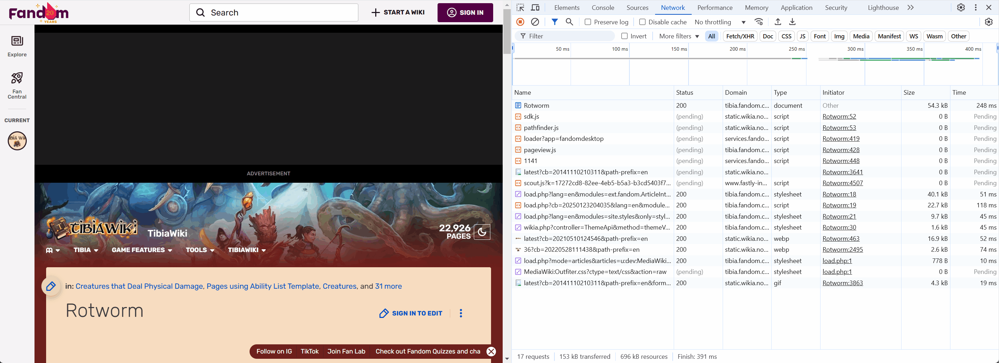

# Tibia Wiki Domain Blocker

## Purpose

The purpose of this extension is to speed up the Tibia Fandom wiki page by blocking all external scripts and resources. This significantly reduces the page load time and the amount of data transferred.

## Before and After

### Before

- Load Time: 5 minutes
- Number of Requests: 2000+
- Data Transferred: 130+ MB

### After

- Load Time: 2.35 seconds
- Number of Requests: 66
- Data Transferred: 1.7 MB

## Installation

1. Clone or download this repository.
2. Open Chrome and navigate to `chrome://extensions/`.
3. Enable "Developer mode" in the top right corner.
4. Click "Load unpacked" and select the directory containing the extension files.

## How It Works

This extension uses the `chrome.declarativeNetRequest` API to block all network requests that are not from the `tibia.fandom.com` domain. This prevents external scripts and resources from being loaded, resulting in a much faster page load time.

## Permissions

- `host_permissions`: It only applies to the `tibia.fandom.com` domain.

## Disclaimer

Use at your own risk.  
This extension may break the site if it depends on scripts from other sources.  
 Additionally, the page depends on ads, and this script blocks them too. While the ads make the page unusable, blocking them cuts off the finances so consider supporting in another way.

## Contributing

We welcome contributions! If you would like to help out, please create a pull request with your changes. Make sure to follow the existing code style and include a description of your changes.

## License

This project is licensed under the MIT License.